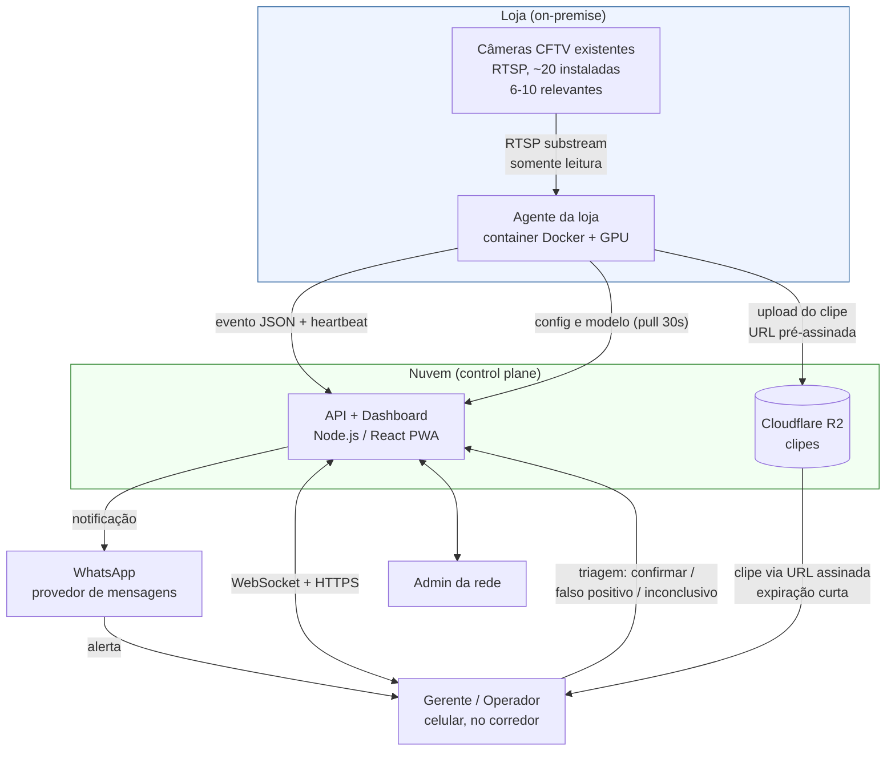
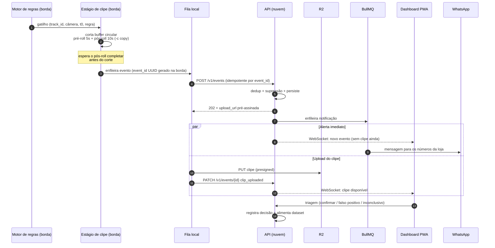
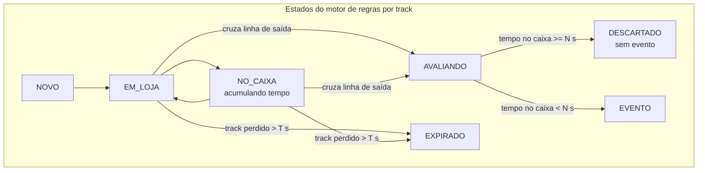
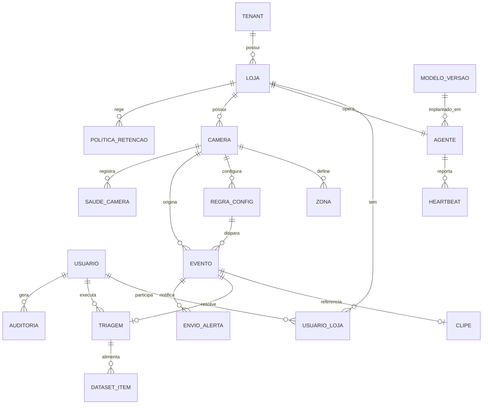

# Arquitetura — Sistema de Detecção de Furtos em Varejo

**Status:** rascunho de arquitetura (pré-implementação)
**Escopo:** MVP / v1
**Última atualização:** 2026-08-11

> Este documento descreve a arquitetura pretendida. Nenhum código foi escrito ainda.
> Todos os limiares numéricos aqui são **hipóteses de projeto**, não medições. Onde
> aparece "a validar por benchmark", o número existe para dimensionar decisões e
> precisa ser confirmado com hardware e vídeo reais antes de virar contrato.

---

## 1. Visão geral e princípio organizador

O sistema detecta situações de possível furto em mercados de bairro reaproveitando
as câmeras de CFTV já instaladas na loja. Uma loja típica tem ~20 câmeras, das quais
6 a 10 são relevantes para IA (saída, caixas, gôndolas específicas).

O sistema **não decide nada sozinho**. Ele produz um *alerta* composto de metadados
do evento e um clipe curto de vídeo, e um humano confirma ou descarta. Isso é
requisito de produto e de conformidade, não um detalhe de implementação: não existe
caminho no sistema em que uma detecção automática produza consequência sem passar
por triagem humana.

### Princípio organizador

**A borda decide, a nuvem administra.**

- O vídeo **nunca sai da loja**. O que sobe é o evento (JSON, poucos KB) e o clipe
  do evento (~15 s).
- A borda é autônoma: com a internet caída, ela continua ingerindo, detectando,
  avaliando regras e gerando clipes. A nuvem é o plano de controle e de
  administração, não o caminho crítico da detecção.
- A nuvem detém a verdade sobre *configuração* (zonas, limiares, câmeras, usuários,
  versão de modelo) e sobre o *histórico* (eventos, triagens, auditoria).

### Consequências diretas do princípio

| Consequência | Implicação prática |
|---|---|
| Vídeo contínuo nunca é gravado nem transmitido | Buffer circular em RAM; só o clipe do evento é persistido |
| Custo de nuvem é quase independente do número de câmeras | Nuvem escala com nº de *eventos*, não com nº de *frames* |
| Link da loja não é ponto único de falha da detecção | Fila local + reenvio idempotente |
| CAPEX por loja | Cada loja precisa de um box com GPU |

### Requisitos não funcionais que dirigem a arquitetura

| # | Requisito | Onde é resolvido |
|---|---|---|
| NFR-1 | Evento → alerta no celular em ≤ 15 s | Orçamento de latência (§3.7); upload direto do clipe para R2 |
| NFR-2 | ≤ 3 alertas falsos por câmera por dia | Motor de regras + supressão + calibração por câmera (§3.4, §3.6) |
| NFR-3 | Nunca gravar vídeo contínuo | Buffer circular em RAM, sem escrita em disco fora do clipe (§3.5) |
| NFR-4 | Sem dado biométrico no MVP | Modelo só emite caixas de "pessoa"/"objeto"; sem embedding facial (§9) |
| NFR-5 | Inferência implantável em nuvem **ou** on-premise sem mudar código | Serviço em container, configuração 100% externa (§3, ADR-001) |
| NFR-6 | Isolamento estrito entre tenants | `tenant_id` obrigatório em toda query; credencial de agente escopada à loja (§4.4) |
| NFR-7 | Clipes só por URL assinada de expiração curta | R2 com presigned URL; download registrado em auditoria (§4.3, §6) |
| NFR-8 | Funcionar com internet instável | Fila local durável + backoff + idempotência (§3.6, §5.4) |
| NFR-9 | Triagem em ≤ 2 toques no celular | PWA com fila de triagem e ações primárias fixas (§4.5) |

---

## 2. Diagramas

### 2.1 Diagrama de contexto

O vídeo bruto existe apenas dentro da caixa `LOJA`. A única mídia que cruza a
fronteira é o clipe de ~15 s do evento.

### 2.2 Diagrama de componentes

```mermaid
flowchart LR
    subgraph EDGE["Agente da loja — docker compose"]
        direction TB

        subgraph PIPE["Pipeline de 5 estágios (pipes and filters)"]
            direction TB
            S1["1. Ingestão<br/>1 ffmpeg por câmera<br/>NVDEC quando disponível"]
            S2["2. Detecção<br/>YOLO, amostragem 3 fps"]
            S3["3. Tracking<br/>ByteTrack ou equivalente"]
            S4["4. Motor de regras<br/>máquina de estados por track"]
            S5["5. Clipe<br/>buffer circular 30s em RAM<br/>corte ffmpeg -c copy"]
            S1 -->|"frames decodificados<br/>fila em memória"| S2
            S2 -->|"detecções"| S3
            S3 -->|"tracks"| S4
            S4 -->|"gatilho de evento"| S5
        end

        SUP["Supervisor / uploader"]
        QL[("Fila local durável<br/>SQLite ou Redis")]
        RD[("Redis local")]
        TS["Tailscale<br/>acesso remoto"]
        UPD["Atualizador de imagem<br/>watchtower ou script"]

        S5 --> QL
        S4 --> QL
        QL --> SUP
        RD -.-> QL
    end

    subgraph CLOUD["Control plane"]
        direction TB
        APIF["API Fastify<br/>não recebe vídeo"]
        PG[("PostgreSQL<br/>Prisma")]
        BQ["BullMQ + Redis"]
        W1["Worker: WhatsApp"]
        W2["Worker: thumbnail"]
        W3["Worker: relatório diário"]
        W4["Worker: expurgo / retenção"]
        WS["Gateway WebSocket"]
        APIF --> PG
        APIF --> BQ
        BQ --> W1
        BQ --> W2
        BQ --> W3
        BQ --> W4
        APIF --> WS
    end

    R2[("Cloudflare R2")]
    PWA["Dashboard React PWA"]
    WA["WhatsApp API"]

    SUP -->|"POST /v1/events<br/>POST /v1/heartbeat"| APIF
    SUP -->|"GET /v1/config (30s)<br/>GET /v1/model"| APIF
    SUP -->|"PUT clipe (presigned)"| R2
    TS -.->|"suporte / debug"| EDGE
    UPD -.-> EDGE
    W1 --> WA
    WS <--> PWA
    APIF <--> PWA
    R2 -->|"GET assinado"| PWA
```

### 2.3 Sequência: do gatilho ao alerta no celular

O alerta é emitido **antes** de o clipe terminar de subir. O gerente recebe a
notificação e, ao abrir, o clipe já deve estar disponível — ou aparece um estado
"processando" explícito. Isso protege o NFR-1 quando o link da loja está lento.

---

## 3. Detalhamento da borda

Um agente por loja. Container Docker rodando em um desktop com GPU dentro da loja.
O agente é um pipeline de 5 estágios com filas entre eles (*pipes and filters*):
cada estágio tem uma responsabilidade única, consome de uma fila e produz em outra,
e pode ser instrumentado e substituído isoladamente.

**Container por loja, não por câmera.** Todas as câmeras compartilham o mesmo
processo de inferência para não replicar o modelo na VRAM. As câmeras entram no
mesmo batch de inferência quando possível.

### 3.1 Estágio 1 — Ingestão

**Responsabilidade.** Um processo `ffmpeg` por câmera lendo o **substream** RTSP
(640x480). Decode em hardware via NVDEC quando disponível, com fallback para CPU.
Entrega frames decodificados com *timestamp* monotônico da borda.

Usar o substream é deliberado: o mainstream (1080p+) multiplicado por 6–10 câmeras
consome banda de rede interna, VRAM e ciclos de decode sem ganho proporcional de
acurácia na escala de uma pessoa em quadro. O clipe entregue ao operador também vem
do substream — resolução suficiente para triagem, não para perícia.

**Ponto crítico:** o decode acontece em **todos** os frames que chegam (~15 fps por
câmera, a confirmar pelo que as câmeras da loja realmente entregam). A amostragem
de 3 fps do estágio 2 economiza **inferência**, não decode. Portanto o
dimensionamento de CPU/NVDEC deve ser feito sobre a taxa cheia.

**Falhas esperadas**

| Falha | Comportamento |
|---|---|
| Câmera offline / RTSP recusa conexão | Reconexão com backoff exponencial + jitter; após limiar, alerta técnico de câmera offline |
| Stream trava sem fechar a conexão | *Watchdog* por ausência de frame novo; mata e recria o processo ffmpeg |
| Câmera muda de IP (DHCP) | Falha de conexão tratada como offline; resolução manual via configuração |
| Corrupção de pacotes / pixelação | Frames inválidos descartados; taxa de descarte vai no heartbeat |
| Relógio da câmera fora de sincronia | Timestamp de referência é o da borda, nunca o da câmera |

### 3.2 Estágio 2 — Detecção

**Responsabilidade.** Rodar YOLO sobre os frames amostrados a 3 fps e emitir caixas
de pessoas e objetos com confiança. O modelo responde apenas **onde estão pessoas e
objetos** — não avalia intenção, não classifica comportamento, não identifica
indivíduos.

A amostragem de 3 fps é o equilíbrio entre custo de inferência e não perder o
instante da travessia da linha de saída (~333 ms entre frames avaliados). Se a
validação mostrar que travessias rápidas escapam, a mitigação é aumentar a taxa
apenas nas câmeras de saída, não globalmente. **A validar por benchmark.**

**Falhas esperadas**

| Falha | Comportamento |
|---|---|
| Fila de entrada crescendo (GPU saturada) | Descarte de frames mais antigos (política *drop oldest*); profundidade de fila vai no heartbeat |
| GPU indisponível / driver caiu | Fallback para CPU em taxa reduzida **ou** parada do estágio com alerta técnico — decisão a fechar após benchmark |
| Oclusão, contraluz, aglomeração | Detecções perdidas; é aceito como perda de recall, tratado no estágio 3 |
| Modelo novo pior que o anterior | Rollback de versão comandado pela nuvem (ADR-006) |

### 3.3 Estágio 3 — Tracking

**Responsabilidade.** ByteTrack ou equivalente, associando detecções entre frames e
atribuindo um ID persistente por pessoa **dentro daquela câmera**. Sem
re-identificação entre câmeras e sem qualquer característica biométrica: o ID é
local, efêmero e descartado ao fim do track.

**Este é o estágio mais frágil do sistema inteiro** (ver §7). Um track que troca de
ID no meio do percurso quebra a premissa do motor de regras: a pessoa "some" no
caixa e "nasce" na linha de saída sem histórico, produzindo falso positivo.

**Falhas esperadas**

| Falha | Comportamento |
|---|---|
| Troca de ID (*ID switch*) em cruzamento de pessoas | Falso positivo ou falso negativo; sem mitigação automática no v1 |
| Track perdido por oclusão longa | Track expira; reaparição vira track novo |
| Fragmentação em corredor cheio | Múltiplos tracks curtos para a mesma pessoa |
| Objetos estáticos detectados como pessoa | Filtro por tempo mínimo de vida do track antes de valer para regra |

### 3.4 Estágio 4 — Motor de regras

**Responsabilidade.** Máquina de estados por track, avaliando zonas e tempos. As
zonas são polígonos e linhas desenhados sobre o frame no dashboard: linha de saída,
área de caixa, gôndola monitorada.

**Regra principal do MVP:** pessoa cruza a linha de saída sem ter permanecido na
zona do caixa por mais de N segundos.

O motor é **separado do modelo** (ADR-002). Zonas, tempos e limiares são
configuração versionada em banco, por câmera. Recalibrar uma loja é mudar
configuração — não retreinar rede, não republicar imagem.

Detalhes que a implementação precisa resolver:

- **Direção da travessia.** A linha de saída é orientada; cruzar de dentro para fora
  dispara, o inverso não.
- **Ponto de referência do track.** A travessia é avaliada sobre um ponto do
  *bounding box* (base central é o candidato natural). **A validar por benchmark.**
- **Debounce de travessia.** Track oscilando sobre a linha não pode gerar N eventos.
- **Tempo mínimo de vida do track** antes de ele ser elegível a gerar evento.

**Falhas esperadas**

| Falha | Comportamento |
|---|---|
| Track nasce já fora do caixa (ID switch) | Falso positivo — causa raiz mais provável de FP no v1 |
| Zonas desenhadas erradas ou câmera reposicionada | Falso positivo em massa naquela câmera; detectável por taxa anômala |
| Cliente sai sem comprar (só olhou) | Falso positivo legítimo da regra; é limitação conhecida do MVP |
| Funcionário circulando pela saída | Falso positivo recorrente; mitigável por zona de exclusão ou janela de horário |

### 3.5 Estágio 5 — Clipe

**Responsabilidade.** Manter um buffer circular dos últimos 30 s por câmera **em
RAM** e, no gatilho, cortar pré-roll de 5 s + pós-roll de 10 s com `ffmpeg` em modo
`copy` — sem re-encode.

O modo `copy` é o que torna o corte barato o suficiente para caber no orçamento de
latência: nenhum frame é recodificado. O custo é que o corte se alinha ao keyframe
mais próximo, então o clipe pode começar um pouco antes do pré-roll pedido. Isso é
aceitável — clipe um pouco maior não atrapalha triagem.

O buffer é **exclusivamente em RAM**. Não há gravação contínua em disco em nenhum
ponto do sistema (NFR-3). O único arquivo de vídeo que existe é o clipe do evento,
e ele é apagado do disco local após o upload ser confirmado.

**Falhas esperadas**

| Falha | Comportamento |
|---|---|
| RAM insuficiente para 30 s × N câmeras | Dimensionamento do box; buffer por câmera com teto rígido |
| Gatilho perto do início do buffer | Pré-roll entregue menor que 5 s; registrado no evento |
| Pós-roll ainda não existe no momento do gatilho | Aguarda 10 s antes de cortar — custo explícito no orçamento de latência |
| Corte falha (keyframe ausente, container inválido) | Evento sobe **sem** clipe, marcado como `clip_failed`; triagem fica prejudicada mas o alerta não se perde |
| Reinício do container | Buffer em RAM é perdido; eventos em voo sem clipe |

### 3.6 Fila local e envio

Cada evento nasce com um **UUID gerado na borda**. Esse ID é a chave de
idempotência: reenviar o mesmo evento nunca cria duplicata na nuvem.

A fila local guarda o evento antes do envio. Com a internet caída, o pipeline
continua rodando normalmente: detecta, avalia regras, gera clipe e acumula na fila.

**Decidido: Redis no próprio box** (ADR-004), fechando a pendência §10.9. Custo
assumido: com `appendonly yes` e o `appendfsync everysec` padrão, uma queda de
energia leva junto até ~1 s de fila. Na prática é o último evento antes do apagão —
e um apagão na loja já derruba as câmeras junto. Em troca, o compose do box não
ganha mais um mecanismo de persistência e o estado sobrevive a restart do agente,
que é o caso comum (atualização por watchtower, §3.8).

Estruturas, e o porquê de cada uma:

| Chave | Tipo | Papel |
|---|---|---|
| `…:event:{id}` | HASH | payload congelado e o estado do item |
| `…:events` / `…:clips` | ZSET | agenda: `event_id` → quando pode sair |
| `…:births` | ZSET | nascimento, para o TTL |
| `…:dead` | ZSET | fila morta, aparada por posto |

ZSET e não LIST porque **o backoff é um agendamento**: com lista, adiar um item
exigiria segurá-lo na memória do processo, e uma queda perderia justamente o evento
que estava sendo reenviado. A reserva de um item é um script Lua que empurra o score
para frente em vez de remover — se o agente cair no meio de uma tentativa, o lease
vence e o evento volta sozinho.

- **Ordem de envio:** eventos primeiro, clipes depois. O metadado é pequeno e
  destrava o alerta; o clipe é grande e pode esperar.
- **TTL:** evento na fila além de um limite (candidato: 24 h) é descartado com
  registro — alertar sobre um furto de ontem tem valor operacional baixo e ocupa a
  fila de triagem.
- **Teto de disco:** o clipe pendente ocupa disco local; ao atingir o teto,
  descarta-se o clipe mais antigo (o evento sobrevive sem clipe).

### 3.7 Orçamento de latência (hipótese)

NFR-1 exige ≤ 15 s do evento até o alerta no celular. Alocação proposta:

| Etapa | Orçamento proposto |
|---|---|
| Amostragem + inferência + tracking + regra | a validar por benchmark |
| Espera do pós-roll (fixo, por definição) | 10 s |
| Corte do clipe (`-c copy`) | a validar por benchmark |
| POST do evento + resposta da API | a validar por benchmark |
| Enfileiramento e envio do WhatsApp | a validar por benchmark |

Os 10 s de pós-roll consomem dois terços do orçamento e são incompressíveis sem
mudar o requisito de produto. **A folga real do sistema é pequena** — daí a decisão
de disparar o alerta antes do upload do clipe (§2.3). Se o benchmark mostrar que não
cabe, as alavancas são: reduzir o pós-roll, ou notificar em dois tempos (aviso
imediato no gatilho + clipe depois).

### 3.8 Composição do agente

Junto no `docker-compose` do box da loja:

- **redis** — fila local e coordenação entre estágios.
- **tailscale** — acesso remoto para suporte sem mexer no roteador da loja. Mercado
  de bairro não tem IP fixo nem alguém para abrir porta no NAT.
- **watchtower ou script próprio** — atualização da imagem do agente.

### 3.9 Portabilidade nuvem / on-premise (NFR-5)

O serviço de inferência é o mesmo artefato nos dois modos. Nada de `if cloud`. O que
muda é **configuração externa**: endpoint da API, origem dos streams, presença de
GPU, credenciais. O container não sabe onde está rodando. Isso mantém aberta a opção
de operar lojas pequenas com processamento centralizado sem bifurcar a base de
código.

---

## 4. Detalhamento do control plane

A nuvem administra: cadastro, configuração, histórico, notificação e triagem. **Ela
não recebe vídeo em nenhum momento.**

### 4.1 API — Node.js (Fastify + Prisma)

Responsável por: autenticação e autorização, CRUD de lojas/usuários/câmeras/zonas,
recepção de eventos e heartbeats dos agentes, emissão de URLs pré-assinadas, fila de
triagem, relatórios e auditoria.

A API é o único ponto que fala com o PostgreSQL. O agente nunca toca o banco.

### 4.2 PostgreSQL

Fonte da verdade de configuração e histórico. Toda tabela com dado de tenant carrega
`tenant_id`, e o acesso é sempre filtrado por ele (NFR-6). Isolamento por linha com
`tenant_id` obrigatório é a estratégia do v1; RLS no Postgres fica como
endurecimento posterior.

### 4.3 BullMQ + Redis

Trabalho assíncrono, para manter a API previsível:

| Job | Função |
|---|---|
| `whatsapp.send` | Envia o alerta aos números da loja; retry com backoff |
| `clip.thumbnail` | Gera thumbnail do clipe após o upload |
| `report.daily` | Relatório diário por loja |
| `retention.purge` | Expurgo de clipes e dados vencidos conforme política |
| `camera.health` | Avalia heartbeats ausentes e abre alerta técnico |

### 4.4 Cloudflare R2

Armazena os clipes. O agente sobe o clipe **direto** para o R2 via URL pré-assinada
emitida pela API — o vídeo não passa pela API em nenhum momento, o que mantém a API
sem I/O pesado e o custo de egress previsível.

Leitura também é só por URL assinada de expiração curta (NFR-7). Todo download é
registrado no log de auditoria com usuário, evento e horário.

Chave do objeto inclui `tenant_id` e `event_id`, e nenhum caminho é adivinhável.

### 4.5 WebSocket e dashboard

- **WebSocket** — push de novos eventos para dashboards abertos. Canal por loja;
  autorização verificada na conexão e na inscrição.
- **Dashboard React (PWA)** — o uso principal é o celular do gerente, em pé, no
  corredor. Isso é premissa de design, não detalhe: a fila de triagem precisa abrir
  o clipe e resolver o evento em **no máximo 2 toques** (NFR-9). Um toque abre o
  evento com o vídeo já em reprodução; o segundo é a decisão — confirmar, falso
  positivo ou inconclusivo — em botões grandes e fixos.

Toda triagem é obrigatória e alimenta o dataset de melhoria do modelo. Evento sem
triagem é dívida operacional visível no dashboard, não um estado silencioso.

### 4.6 Supressão de duplicados

Duas camadas:

1. **Idempotência** — `event_id` gerado na borda impede duplicata por reenvio.
2. **Supressão semântica** — na nuvem, eventos da mesma câmera e mesma regra dentro
   de uma janela curta são agrupados em um único alerta. A janela é configurável por
   câmera; valor inicial **a validar por benchmark**.

A supressão protege diretamente o NFR-2: uma câmera mal calibrada disparando em
rajada deve produzir um alerta agrupado, não trinta notificações.

---

## 5. Contrato entre agente e nuvem

Princípio: **configuração é puxada, nunca empurrada** (ADR-003). A nuvem nunca abre
conexão para a loja. Isso elimina dependência de IP fixo, VPN ou NAT traversal — o
agente é sempre o cliente.

### 5.1 Autenticação

- Provisionamento: token de bootstrap de uso único, gerado no dashboard ao cadastrar
  a loja, trocado por credencial de longa duração do agente.
- Credencial escopada a **uma** loja. Um agente comprometido não alcança outro tenant.
- Rotação de credencial comandada pela nuvem via resposta de configuração.

### 5.2 Endpoints

| Método | Rota | Direção | Descrição |
|---|---|---|---|
| `POST` | `/v1/agents/register` | agente → nuvem | Troca token de bootstrap por credencial |
| `GET` | `/v1/agents/config` | agente → nuvem | Configuração da loja. Poll a cada 30 s, com `ETag`/`version`; resposta vazia (`304`) quando nada mudou |
| `POST` | `/v1/agents/heartbeat` | agente → nuvem | Telemetria periódica (§5.3) |
| `POST` | `/v1/events` | agente → nuvem | Envia o evento. Idempotente por `event_id`. Resposta traz `clip_upload_url` |
| `PUT` | *(URL pré-assinada R2)* | agente → R2 | Upload do clipe. Não passa pela API |
| `PATCH` | `/v1/events/{event_id}` | agente → nuvem | Confirma upload do clipe ou marca `clip_failed` |
| `GET` | `/v1/models/current` | agente → nuvem | Versão de modelo alvo + URL assinada de download + checksum |
| `POST` | `/v1/agents/logs` | agente → nuvem | Envio em lote de logs e diagnóstico (baixa prioridade) |

O que trafega, resumido:

- **Sobe:** evento (JSON), clipe (~15 s, substream), heartbeat, logs.
- **Desce:** configuração (câmeras, zonas, regras, limiares, versão de modelo alvo),
  binário do modelo, comandos de manutenção.
- **Nunca trafega:** vídeo contínuo, frames avulsos, imagem de pessoa fora do clipe
  de um evento, qualquer dado biométrico.

### 5.3 Heartbeat

Enviado periodicamente (candidato: junto ao poll de 30 s). Conteúdo:

| Campo | Uso |
|---|---|
| `agent_version`, `model_version`, `config_version` | Detectar agentes desatualizados ou rollback não aplicado |
| `queue_depth`, `queue_oldest_age`, `queue_bytes` | Detectar loja com link caído ou fila represada |
| Por câmera: `status` (`ok` / `reconnecting` / `offline`) | Alerta técnico de câmera offline |
| Por câmera: `decode_fps`, `inference_fps`, `dropped_frames` | Detectar box saturado ou câmera degradada |
| Por câmera: `last_frame_at` | Distinguir "stream travado" de "stream ausente" |
| `gpu_util`, `vram_used`, `cpu`, `ram`, `disk_free`, `temp` | Saúde do hardware da loja |
| `clock_skew` | Divergência de relógio contra a nuvem |
| `uptime`, `restarts` | Detectar crash loop |

Ausência de heartbeat por um limite configurado abre alerta técnico de **agente
offline** — distinto de câmera offline, porque a ação é diferente.

### 5.4 Política de retry

| Situação | Política |
|---|---|
| `POST /v1/events` falha (rede, `5xx`) | Backoff exponencial com jitter, com teto; evento permanece na fila local |
| `POST /v1/events` retorna `4xx` de validação | Não reenvia; move para fila morta local e registra em log |
| Upload do clipe falha | Retry com nova URL pré-assinada (a anterior pode ter expirado); após N tentativas, marca `clip_failed` e preserva o evento |
| `GET /v1/agents/config` falha | Mantém a última configuração válida em cache local e segue operando |
| Download de modelo falha ou checksum não bate | Descarta, mantém a versão atual, reporta no heartbeat |
| Nuvem inteira indisponível | Pipeline continua; fila acumula até TTL/teto de disco (§3.6) |

Regra geral: **nenhuma falha de rede pode parar a detecção**. Todo caminho para a
nuvem é assíncrono em relação ao pipeline.

---

## 6. Modelo de dados em alto nível

Entidades e relações, sem schema completo.

| Entidade | Papel |
|---|---|
| `TENANT` / `LOJA` | Raiz de isolamento. `tenant_id` presente em toda entidade de dado |
| `USUARIO` / `USUARIO_LOJA` | Usuário e seu papel na loja: admin, gerente, operador |
| `AGENTE` | O box da loja: credencial, versões instaladas, último heartbeat |
| `CAMERA` | Câmera RTSP: endereço, substream, se é relevante para IA, estado de saúde |
| `ZONA` | Geometria sobre o frame: linha de saída (orientada), área de caixa, gôndola |
| `REGRA_CONFIG` | Regra por câmera com limiares versionados (ex.: N segundos no caixa). Versionada para que um evento antigo saiba sob qual configuração nasceu |
| `EVENTO` | `event_id` (UUID da borda), câmera, regra, instantes, estado do clipe, agrupamento de supressão |
| `CLIPE` | Chave no R2, duração, pré/pós-roll efetivos, data de expurgo |
| `TRIAGEM` | Decisão humana: confirmado / falso positivo / inconclusivo, autor e horário |
| `ENVIO_ALERTA` | Cada notificação despachada (WhatsApp, WebSocket) e seu resultado |
| `HEARTBEAT` / `SAUDE_CAMERA` | Séries de telemetria, com retenção própria e curta |
| `MODELO_VERSAO` | Versão de modelo, checksum, alvo de implantação, histórico de rollback |
| `POLITICA_RETENCAO` | Prazos por tipo de dado; base do job de expurgo |
| `AUDITORIA` | Acesso e download de clipes: quem, qual evento, quando, de onde |
| `DATASET_ITEM` | Referência do evento triado usada para melhoria do modelo |

Notas de modelagem:

- `EVENTO` guarda a **versão da regra e do modelo** vigentes no momento. Sem isso,
  não é possível interpretar uma taxa histórica de falso positivo.
- `TRIAGEM` é separada de `EVENTO` porque a decisão é um ato humano auditável, com
  autor e horário próprios — não um campo mutável do evento.
- `AUDITORIA` é *append-only*.

---

## 7. Riscos

**O maior risco deste projeto não é a arquitetura.** É a robustez do tracking e a
taxa de falso positivo. Se o gerente receber 30 alertas falsos na primeira semana,
ele desliga a notificação e o produto morre — independentemente de a arquitetura
estar correta, do custo estar baixo e da latência caber no orçamento.

Tudo que está descrito acima existe para tornar esse problema *tratável*: separar
regras do modelo permite recalibrar sem retreinar; a triagem obrigatória gera o
dataset; a supressão limita o dano de uma câmera mal ajustada; o versionamento de
modelo permite rollback. Nada disso resolve o problema — apenas dá as alavancas.

| # | Risco | Severidade | Mitigação |
|---|---|---|---|
| R-1 | **Taxa de falso positivo acima do tolerável** (NFR-2). Gerente abandona o produto | **Crítica** | Piloto em loja única antes de escalar; supressão de duplicados; limiares por câmera; teto diário de alertas por câmera com o excedente indo para revisão em lote; medir FP/câmera/dia como métrica número 1 do produto |
| R-2 | **Tracking frágil** — ID switch em cruzamento de pessoas quebra a premissa da regra | **Crítica** | Tempo mínimo de vida do track; debounce de travessia; coleta de casos difíceis via triagem; avaliar tracker alternativo com dados reais antes de fechar a escolha |
| R-3 | **Posicionamento das câmeras existentes é inadequado** (ângulo, altura, contraluz na porta) | **Alta** | Checklist de qualificação da loja antes da venda; marcar câmeras como não elegíveis para IA; possibilidade de reposicionar apenas as 2–3 críticas |
| R-4 | **Hardware da loja insuficiente** para 6–10 câmeras com decode em taxa cheia | **Alta** | Benchmark antes de definir o box de referência; heartbeat com `dropped_frames` e `queue_depth` para detectar saturação em campo; reduzir nº de câmeras ativas como válvula de escape |
| R-5 | **Orçamento de latência não fecha** (§3.7), sobretudo com link ruim | **Média** | Alerta disparado antes do upload do clipe; medir cada etapa em produção; alavancas: reduzir pós-roll ou notificar em dois tempos |
| R-6 | **Box da loja falha** (energia, disco, GPU) e ninguém percebe | **Alta** | Alerta de agente offline por ausência de heartbeat; acesso remoto via Tailscale; nobreak recomendado no checklist |
| R-7 | **Atualização remota quebra a loja** e exige visita presencial | **Alta** | Rollout gradual por lojas; healthcheck pós-atualização com rollback automático de imagem; nunca atualizar todas as lojas ao mesmo tempo |
| R-8 | **Vazamento de clipe** ou acesso indevido entre tenants | **Alta** | `tenant_id` obrigatório; URL assinada de expiração curta; auditoria de todo download; chave de objeto não adivinhável |
| R-9 | **Enquadramento LGPD** — imagem de pessoa identificável é dado pessoal, mesmo sem biometria | **Alta** | Minimização (só o clipe do evento); sem reconhecimento facial no v1; retenção curta com expurgo automático; auditoria de acesso; cartazes de aviso e base legal a definir com apoio jurídico |
| R-10 | **Uso indevido pelo lojista** — tratar alerta como acusação e abordar cliente | **Alta** | Triagem humana obrigatória por design; linguagem do produto sempre "possível ocorrência"; material de treinamento sobre o que o alerta não significa |
| R-11 | **Desenvolvedor solo** — superfície operacional grande (borda + nuvem + modelo) para uma pessoa | **Média** | Priorizar uma loja piloto; automatizar provisionamento e atualização desde o início; evitar variação por loja |
| R-12 | **Custo de WhatsApp** cresce com volume de alertas | **Baixa** | Agrupamento de alertas; teto diário por loja; WebSocket como canal primário quando o dashboard está aberto |
| R-13 | **Internet instável prolongada** — fila estoura TTL e eventos se perdem | **Média** | TTL e teto configuráveis; heartbeat expõe `queue_oldest_age`; clipes são descartados antes dos eventos |

---

## 8. Índice dos ADRs

> Os arquivos em `docs/adr/` ainda não foram criados. Esta seção registra as
> decisões e reserva a numeração. Cada ADR deve seguir o formato: **contexto,
> decisão, alternativas consideradas, consequências (incluindo as negativas)**.
> Alternativa descartada sem motivo escrito não conta como alternativa considerada.

| ADR | Título | Decisão em uma linha | Principal consequência negativa |
|---|---|---|---|
| ADR-001 | `0001-processamento-na-borda.md` | Processar na loja em vez de tudo na nuvem: custo mensal ~4x menor, independência do link da loja, enquadramento LGPD mais simples | CAPEX de hardware por loja e parque físico distribuído para manter |
| ADR-002 | `0002-regras-separadas-do-modelo.md` | O modelo só responde "onde estão pessoas e objetos"; zonas, tempos e limiares são configuração versionada em banco, por câmera | Duas fontes de comportamento (modelo e regras) para depurar quando um evento sai errado |
| ADR-003 | `0003-configuracao-puxada.md` | O agente consulta a nuvem a cada 30 s; a nuvem nunca inicia conexão com a loja | Latência de até 30 s para uma mudança de configuração chegar; tráfego de poll constante |
| ADR-004 | `0004-fila-local-no-agente.md` | Fila local durável no agente, em **Redis** no próprio box, para continuar detectando com a internet caída | Estado durável na borda para gerenciar (TTL, teto de disco, fila morta) e ~1 s de fila perdido numa queda de energia (`appendfsync everysec`) |
| ADR-005 | `0005-amostragem-3fps.md` | Inferência sobre frames amostrados a 3 fps | Risco de perder travessias rápidas da linha de saída; **a validar por benchmark** |
| ADR-006 | `0006-modelo-versionado-com-rollback.md` | Modelo versionado e distribuído pela nuvem, com rollback | Complexidade de distribuição, checksum e compatibilidade agente↔modelo |
| ADR-007 | `0007-container-por-loja.md` | Um container de inferência por loja, não por câmera, para não recarregar o modelo na VRAM | Falha do container derruba todas as câmeras da loja de uma vez |
| ADR-008 | `0008-escopo-fora-do-v1.md` | Exclusões explícitas do v1 (§9) | Lacunas funcionais conhecidas frente a concorrentes |

---

## 9. Fora do escopo do v1 (decisão explícita)

Excluído deliberadamente, não esquecido:

| Item | Motivo da exclusão |
|---|---|
| **Reconhecimento facial e base de reincidentes** | Dado biométrico eleva drasticamente o risco e a exigência de conformidade LGPD, e não é necessário para a regra principal do MVP |
| **Integração com PDV** | Cruzar travessia com venda registrada reduziria muito o falso positivo, mas exige integração por fornecedor de PDV — trabalho grande para desenvolvedor solo. É a evolução natural do produto |
| **Detecção de "item saiu da gôndola" por action recognition** | Exige modelo e dataset próprios; não cabe no v1 |
| **Multi-modelo por loja** | Um único modelo para todas as lojas mantém a distribuição e o rollback simples. Diferenciação por loja é feita nas regras, não no modelo |
| **Re-identificação entre câmeras** | Depende de tracking robusto dentro de uma câmera, que é justamente o risco R-2 |

---

## 10. Pendências que precisam de dado real

Lista viva do que só se resolve com hardware e vídeo da loja piloto:

1. Taxa real de frames entregue pelas câmeras no substream (base do dimensionamento de decode).
2. Custo de inferência por frame no box de referência → nº máximo de câmeras por loja.
3. Latência ponta a ponta medida por etapa (§3.7).
4. Adequação de 3 fps para a travessia da linha de saída.
5. Valor inicial de N segundos na zona do caixa, por layout de loja.
6. Janela de supressão de duplicados.
7. Taxa de ID switch do tracker escolhido em vídeo real de corredor cheio.
8. Consumo de RAM do buffer circular de 30 s × N câmeras.
9. ~~Escolha final entre SQLite e Redis para a fila local.~~ **Fechada: Redis** (§3.6, ADR-004).
10. Comportamento do estágio de detecção quando a GPU cai: fallback em CPU ou parada com alerta.
11. Rolls de clipe por câmera. Hoje o `ClipRecorder` tem um pré/pós-roll para o
    agente inteiro e a subida falha se as câmeras divergirem. Uma câmera de saída com
    GOP longo pode precisar de outra tolerância que a do corredor (§3.4) — resolver
    exige passar as opções por câmera no `attach`.
12. Compose do box da loja (§3.8): agente, redis local, tailscale e watchtower. Hoje
    os testes da fila usam o Redis de desenvolvimento do control plane.
